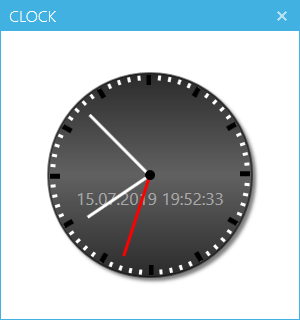

# Analog WPF Clock

This repository is a fork of [Findlay999's AnalogClock-WPF](https://github.com/Findlay999/AnalogClock-WPF). 

What's different?
1. Added the [MahApps.Metro Framework](https://mahapps.com) for a *nice* UI
2. Added [my WPF Framework](https://github.com/InvaderZim85/ZimLabs) 
3. Improved the calculation of the angle for the hour and minute hand. The calculation now consideres the lower value (Hour + Minute, Minute + Seconds), so that the angles are more accurate.
4. Added the current date and time as a digital value to the analog clock

## Screenshot
